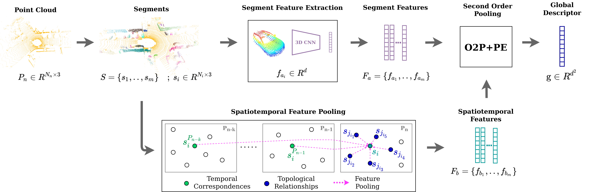
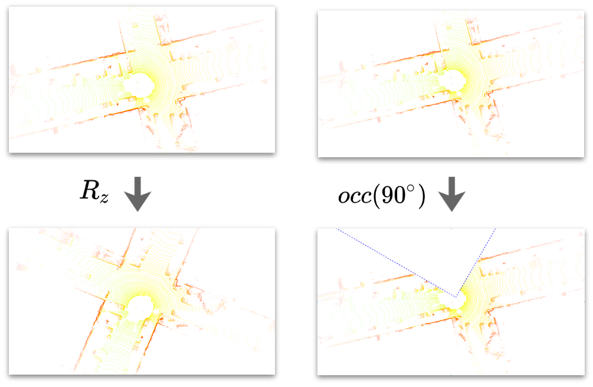

# Locus


This repository is an open-source implementation of the ICRA 2021 paper: [Locus: LiDAR-based Place Recognition using Spatiotemporal Higher-Order Pooling](https://arxiv.org/abs/2011.14497). 

More information: https://research.csiro.au/robotics/locus-pr/

Paper Pre-print: https://arxiv.org/abs/2011.14497

## Method overview.
*Locus* is a global descriptor for large-scale place recognition using sequential 3D LiDAR point clouds. It encodes topological relationships and temporal consistency of scene components to obtain a discriminative and view-point invariant scene representation.




## Usage

### Set up environment
This project has been tested on Ubuntu 18.04 (with [Open3D](http://www.open3d.org/docs/release/) 0.11, [tensorflow](https://www.tensorflow.org/) 1.8.0, [pcl](https://pointclouds.org/) 1.8.1 and [python-pcl](https://github.com/strawlab/python-pcl) 0.3.0). Set up the requirments as follows:
- Create [conda](https://docs.conda.io/en/latest/) environment with open3d and tensorflow-1.8 with python 3.6:
```bash
conda create --name locus_env python=3.6
conda activate locus_env
pip install -r requirements.txt
```
- Set up python-pcl. See ```utils/setup_python_pcl.txt```. For further instructions, see [here](https://github.com/strawlab/python-pcl). 
- Segment feature extraction uses the pre-trained model from [ethz-asl/segmap](https://github.com/ethz-asl/segmap). Download and copy the relevant content in [segmap_data](http://robotics.ethz.ch/~asl-datasets/segmap/segmap_data/) into ```~/.segmap/```:
```bash
./utils/get_segmap_data.bash
```
- Download the [KITTI odometry dataset](http://www.cvlibs.net/datasets/kitti/eval_odometry.php) and set the path in ```config.yml```.


### Descriptor Generation
Segment and generate Locus descriptor for each scan in a selected sequence (e.g., KITTI sequence 06):
```bash
python main.py --seq '06'
```
The following flags can be used with ```main.py```:
- ```--seq```: KITTI dataset sequence number.
- ```--aug_type```: Scan augmentation type (optional for robustness tests).
- ```--aug_param```: Parameter corresponding to above augmentation. 

### Evaluation
Sequence-wise place-recognition using extracted descriptors:
```bash
python ./evaluation/place_recognition.py  --seq  '06' 
```
Evaluation of place-recognition performance using Precision-Recall curves (multiple sequences):  
```bash
python ./evaluation/pr_curve.py 
```

### Additional scripts

#### Robustness tests:
Code of the robustness tests carried out in section V.C in paper. 
Extract Locus descriptors from scans of select augmentation:
```bash
python main.py --seq '06' --aug_type 'rot' --aug_param 180 # Rotate about z-axis by random angle between 0-180 degrees. 
python main.py --seq '06' --aug_type 'occ' --aug_param 90 # Occlude sector of 90 degrees about random heading. 
```
Evaluation is done as before. For vizualization, set ```config.yml->segmentation->visualize``` to ```True```.



#### Testing individual modules: 

```bash
python ./segmentation/extract_segments.py # Extract and save Euclidean segments (S).
python ./segmentation/extract_segment_features.py # Extract and save SegMap-CNN features (Fa) for given S.
python ./descriptor_generation/spatial_pooling.py # Generate and save spatial segment features for given S and Fa.
python ./descriptor_generation/temporal_pooling.py # Generate and save temporal segment features for given S and Fa.
python ./descriptor_generation/locus_descriptor.py # Generate and save Locus global descriptor using above.
```

## Citation

If you find this work usefull in your research, please consider citing:

```
@inproceedings{vid2021locus,
  title={Locus: LiDAR-based Place Recognition using Spatiotemporal Higher-Order Pooling},
  author={Vidanapathirana, Kavisha and Moghadam, Peyman and Harwood, Ben and Zhao, Muming and Sridharan, Sridha and Fookes, Clinton},
  booktitle={IEEE International Conference on Robotics and Automation (ICRA)},
  year={2021},
  eprint={arXiv preprint arXiv:2011.14497}
}
```

## Acknowledgment
Functions from 3rd party have been acknowledged at the respective function definitions or readme files. This project was mainly inspired by the following: [ethz-asl/segmap](https://github.com/ethz-asl/segmap) and [irapkaist/scancontext](https://github.com/irapkaist/scancontext).

## Contact
For questions/feedback, 
 ```
 kavisha.vidanapathirana@data61.csiro.au
 ```
